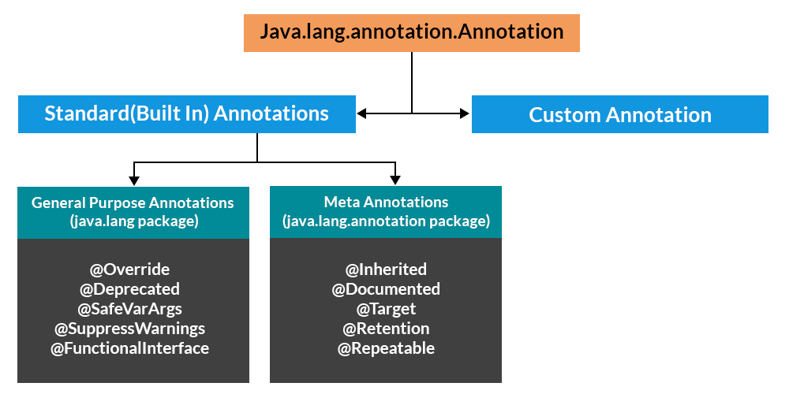

# Annotations

* Annotations are used to provide supplemental information about a program.

* Annotations start with ‘@’.
* Annotations do not change the action of a compiled program.
* Annotations help to associate metadata (information) to the program elements i.e. instance variables, constructors, methods, classes, etc.
* Annotations are not pure comments as they can change the way a program is treated by the compiler. See below code for example.
* Annotations basically are used to provide additional information, so could be an alternative to XML and Java marker interfaces.

**Categories of Annotations**

There are broadly 5 categories of annotations as listed:

1. **Marker Annotations**

   he only purpose is to mark a declaration. These annotations contain no members and do not consist of any data. Thus, its presence as an annotation is sufficient. Since the marker interface contains no members, simply determining whether it is present or absent is sufficient. @Override is an example of Marker Annotation.

    Example

        @TestAnnotation()
    
2. **Single value Annotations**

   These annotations contain only one member and allow a shorthand form of specifying the value of the member. We only need to specify the value for that member when the annotation is applied and don’t need to specify the name of the member. However, in order to use this shorthand, the name of the member must be a value.

    Example

         @TestAnnotation(“testing”);
3. Full Annotations
4. Type Annotations
5. Repeating Annotations

### creating custom annotations