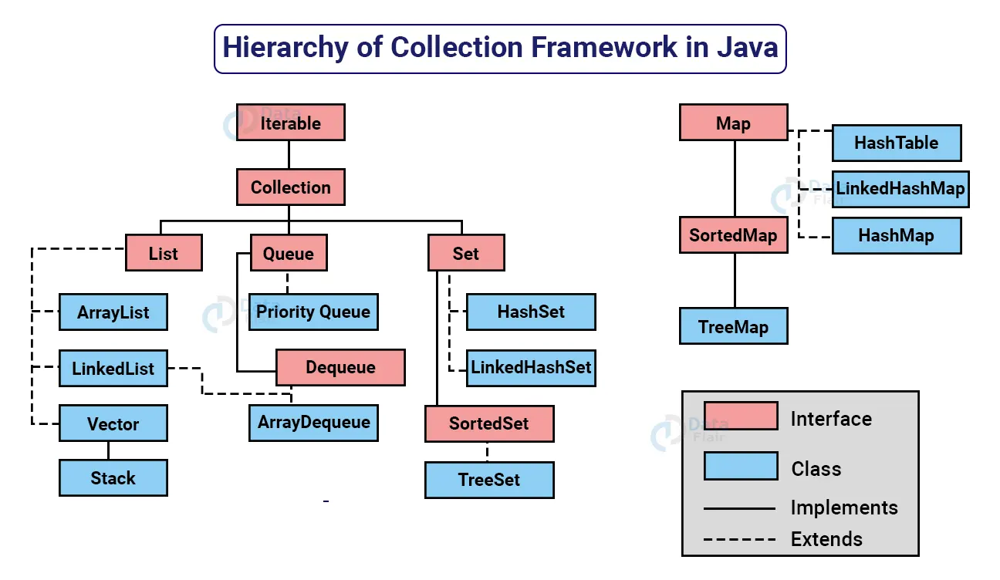
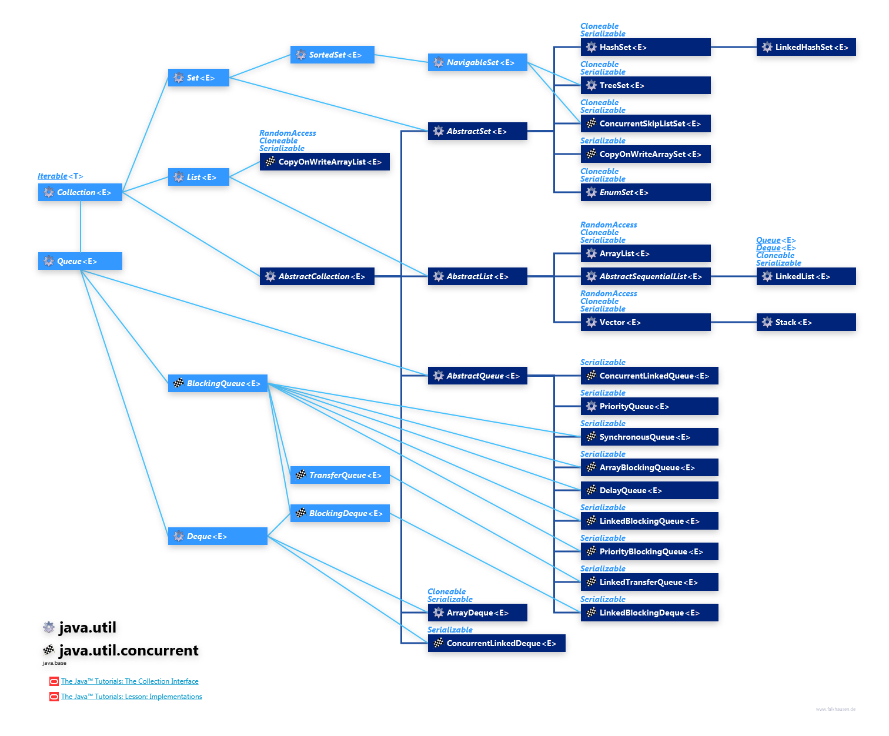
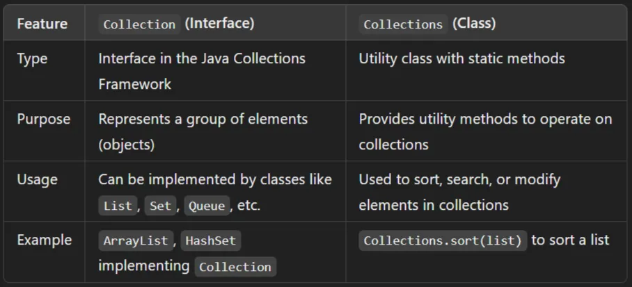

# Collections

## Hierarchy

## Detailed description of collection framework hierarchy

`Iterable Interface`
Iterable Interface is the topmost interface in java.
1. It have a **Iterator interface** which is having has a relationship
2. The Iterable interface is present in java.lang.Iterable package. 
3. It was introduced in JDK 1.5. It allows users to iterate through elements sequentially from a collection. 
4. It returns each element of the collection one after the other, beginning from the front and moving forward. 
5. There are three ways in which elements can be iterated in Java: 

 * the  for loop,
 * the for enhanced loop, and
 * the iterator() method. 
6. The Collection interface extends the Iterable interface thus, all the classes implementing the Collection interface are iterable.

## Traversing using Iterator
1. Enhanced for Loop(for Each).
   
    `for(DataType variable_name : CollectionName){
      //action to be performed
        }`
        
2. using iterator.

        `Iterator<Integer> iter;
        iter = stack.iterator();

        // iterating elements of the set
        while (iter.hasNext()) {
            int nextElement = iter.next();
            System.out.print(nextElement + " ");
        }`
   **if We are using iterating collection with help of advanced for loop for iteration and iterator we will get **Concurrent Modification Exception** if we modify the list.**
   * Iterator interface present inside java.util package.
   * Iterator() is method present inside Iterator interface.
   * Inside ArrayList class iterator method is overridden which returns the object of iterator type
   * some where inside collection framework we have child implementing classes of iterator interface.
   * Iterator design pattern we would use when we don't want to expose out data structures.
     * Iterator is exhaustive in nature.only once we can use.
     * Iterator cannot traverse in reverse.
   * if we want to use again we have to create new iterator these two drawbacks can be overcome by using list  iterator.
   
3. using For Loop.

   `for(DataType variable_name : CollectionName){
     //action to be performed
      }`
## Collection vs Collections

### Collection interface methods
| Method | Description |
|:---|:---|
| `add(E e)` | Ensures that this collection contains the specified element (optional operation). |
| `addAll(Collection<? extends E> c)` | Adds all the elements in the specified collection to this collection (optional operation). |
| `clear()` | Removes all the elements from this collection (optional operation). |
| `contains(Object o)` | Returns true if this collection contains the specified element. |
| `containsAll(Collection<?> c)` | Returns true if this collection contains all the elements in the specified collection. |
| `equals(Object o)` | Compares the specified object with this collection for equality. |
| `hashCode()` | Returns the hash code value for this collection. |
| `isEmpty()` | Returns true if this collection contains no elements. |
| `iterator()` | Returns an iterator over the elements in this collection. |
| `parallelStream()` | Returns a possibly parallel Stream with this collection as its source. |
| `remove(Object o)` | Removes a single instance of the specified element from this collection, if it is present (optional operation). |
| `removeAll(Collection<?> c)` | Removes all of this collection’s elements that are also contained in the specified collection (optional operation). |
| `removeIf(Predicate<? super E> filter)` | Removes all the elements of this collection that satisfy the given predicate. |
| `retainAll(Collection<?> c)` | Retains only the elements in this collection that are contained in the specified collection (optional operation). |
| `size()` | Returns the number of elements in this collection. |
| `spliterator()` | Creates a Spliterator over the elements in this collection. |
| `stream()` | Returns a sequential Stream with this collection as its source. |
| `toArray()` | Returns an array containing all the elements in this collection. |
| `toArray(IntFunction<T[]> generator)` | Returns an array containing all the elements in this collection, using the provided generator function to allocate the returned array. |
| `toArray(T[] a)` | Returns an array containing all the elements in this collection; the runtime type of the returned array is that of the specified array. |

# List Interface
The List Interface
A List is an ordered Collection (sometimes called a sequence). Lists may contain duplicate elements. In addition to the operations inherited from Collection, the List interface includes operations for the following:

* **Positional access** — manipulates elements based on their numerical position in the list. This includes methods such as get, set, add, addAll, and remove.
* **Search**— searches for a specified object in the list and returns its numerical position. Search methods include indexOf and lastIndexOf.
* **Iteration** — extends Iterator semantics to take advantage of the list's sequential nature. The listIterator methods provide this behavior.
* **Range-view** — The sublist method performs arbitrary range operations on the list.

The Java platform contains two general-purpose List implementations. ArrayList, which is usually the better-performing implementation, and LinkedList which offers better performance under certain circumstances.

## List Iterator
list iterator is interface it has a relation with list interface and it is used to overcome the drawbacks of 
iterator interface
* list iterator can traverse in both direction i.e forward and backward
* list iterator is not exhaustive in nature.
* at start cursor is before the first element.
* can use `collectionName.listIterator(index)` to start iteration from particular index.

