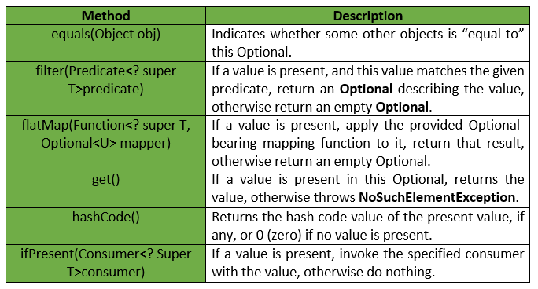

# Optional Classes.
The Optional class in Java provides a way to represent the possibility that a value might be absent, 

offering a more robust and readable alternative to using null. 

It's particularly useful in situations where a method might return null if no value is found, potentially leading to NullPointerExceptions. 

By using Optional, the code can explicitly signal the possibility of a missing value, forcing the developer to handle it gracefully. 

**Use case scenario**

when we are getting data from databases or any other method of class where the method can return the values
null.
there we can get **NullPointerException** if we are trying to call anything on that reference.

Optional class provide flexibility to the programmer to handle it gracefully.

in Optional class we have two method isPresent() and get()

* **isPresent()** - This method is used to check the element(null or not null) is present or not. if null then it return false else true.
* **get()**- get method is used to get the values if the values is present inside that reference.

### best practices for using the Optional class in Java:

* Avoid null assignments to Optional variables:

  Instead, initialize Optional with Optional.empty() if there's no value or Optional.of(value) if a value is present.

* Don't use Optional.get() without checking isPresent():
  This defeats the purpose of Optional and can lead to NoSuchElementException. Use orElse(), orElseGet(), or orElseThrow() to handle cases where the value is absent.

* Use Optional as a return type:
* It clearly indicates that a method might not return a value.

* Avoid using Optional in fields:
* It is not serializable and can lead to issues with object state and encapsulation. Use a getter method that returns an Optional instead.

* Don't use Optional as a method parameter:
* It can introduce unnecessary complexity and conditional logic within the method.

* Chain Optional methods:
* Use filter(), map(), and flatMap() to perform operations on the value within the Optional in a functional style.

* Handle the absence of a value:
* Use orElse(), orElseGet(), or orElseThrow() to provide a default value, compute a value, or throw an exception when the Optional is empty.

* Avoid nesting Optionals:
* It can make the code harder to read and understand.

* Use Optional to avoid explicit null checks:
* It makes the code more readable and reduces the risk of NullPointerException.

* Consider using Optional for collections or arrays:
* However, prefer returning an empty collection or array instead of an empty Optional.

* Don't overuse Optional:
* It's not meant to replace all null checks. Use it strategically to improve code clarity and prevent NullPointerException in appropriate situations.

