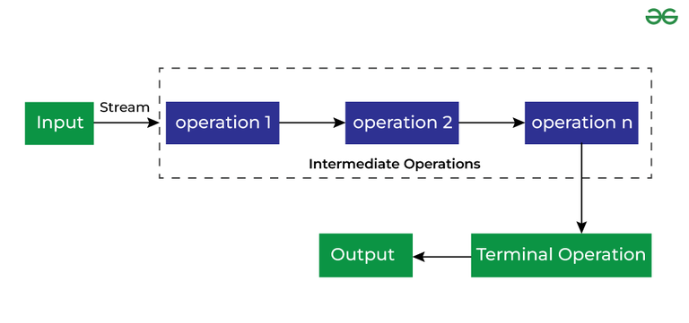

# Stream API
Stream was introduced in Java 8.

the Stream API is used to process collections of objects. A stream in Java is a sequence of objects that supports various methods that can be pipelined to produce the desired result. 

Use of Stream in Java.

* Stream API is a way to express and process collections of objects.
* Enable us to perform operations like filtering, mapping, reducing, and sorting.

<H6>Feature</h6>

* Not Modify the original list.

* **Each intermediate operation is lazily executed and returns a stream as a result, hence, various intermediate operations can be pipelined. Terminal operations mark the end of the stream and return the result.**

### Different Operations On Streams
There are two types of Operations in Streams:

**1. Intermediate Operations**
    
These are the operations(methods) which will return you a stream.

**2. Terminal Operations**
    
These operations(methods) can return void or anything.

* Example....

    `list.stream().filter((element)->{
         System.out.println(element);
         return element%2==0;

    });`

This way it doesn't execute because filter() is an intermediate operN (returns stream) so it will not execute.

**Methods in stream**
### Intermediate Stream Operations

| Method       | Return Type | Description                                                                      |
|--------------|-------------|----------------------------------------------------------------------------------|
| `map()`      | `Stream<R>` | Transforms each element using a function.( formal argument functional interface) |
| `filter()`   | `Stream<T>` | Filters elements based on a predicate.                                           |
| `sorted()`   | `Stream<T>` | Sorts the elements of the stream.                                                |
| `flatMap()`  | `Stream<R>` | Flattens nested collections into a single stream.                                |
| `distinct()` | `Stream<T>` | Removes duplicate elements.                                                      |
| `peek()`     | `Stream<T>` | Performs an action on each element without modifying the stream.                 |
| `limit()`    | `Stream<T>` | Limits the stream to the first N elements.                                       |
| `skip()`     | `Stream<T>` | Skips the first N elements.                                                      |

### Terminal Stream Operations

| Method        | Return Type                        | Description                                                        |
|---------------|------------------------------------|--------------------------------------------------------------------|
| `collect()`   | `Collector Result (e.g., List<T>)` | Collects the stream elements into a collection.                    |
| `forEach()`   | `void`                             | Performs an action for each element.                               |
| `reduce()`    | `Optional<T>` or `T`               | Reduces stream elements to a single value.                         |
| `count()`     | `long`                             | Returns the count of elements.                                     |
| `findFirst()` | `Optional<T>`                      | Returns the first element, if present.                             |
| `findAny()`   | `Optional<T>`                      | Returns any one element (especially useful with parallel streams). |
| `allMatch()`  | `boolean`                          | Checks if all elements match a condition.                          |
| `anyMatch()`  | `boolean`                          | Checks if any element matches a condition.                         |
| `noneMatch()` | `boolean`                          | Checks if no elements match a condition.                           |
| `toArray()`   | `Object[]` or `T[]`                | Converts the stream to an array.                                   |
| `iterator()`  | `Iterator<T>`                      | Returns an iterator over the elements in the stream.               |
| `toList()`    | `List<T>` (Java 16+)               | Collects elements into an immutable list.                          |

