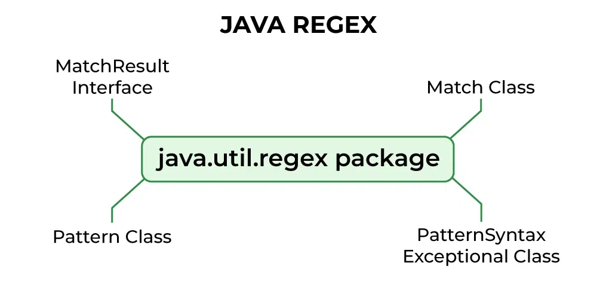

# Regular Expression

Regular Expressions (regex) in Java are patterns used to match character combinations in strings.

Java provides the java.util.regex package for pattern matching using regular expressions.

### Regex Classes and Interfaces
This consists of 3 classes and 1 interface. 

The java.util.regex package primarily consists of the following three classes as depicted below in tabular format as follows:

Class/Interface	Description
* **Pattern Class**	Used for defining patterns
* **Matcher Class**	Used for performing match operations on text using patterns
* **PatternSyntaxException Class**	Used for indicating syntax error in a regular expression pattern
* **MatchResult Interface**	Used for representing the result of a match operation

### Steps for using Regex

1. use compile method inside pattern class to compile the search pattern.

   `Pattern p=Pattern.compile("[a-z]{3}")`

2. the formal argument should be a regular expression to the compile method as per requirement.

3. Use a matcher() to get a matcher object present inside Pattern class.

    `Matcher match=p.matcher("Input String")`

4. formal argument for matcher().a string in which we want to search the pattern.

Q. How to create the Regex??
Ans.get the regex from chatgpt for particular format. or learn all the regex pattern and die peacefully.

## Matcher Class Methods in Java

| Method                       | Description                                                                 |
|------------------------------|-----------------------------------------------------------------------------|
| `matches()`                  | Attempts to match the entire input sequence against the pattern.            |
| `find()`                     | Finds the next subsequence of the input sequence that matches the pattern.  |
| `lookingAt()`                | Attempts to match the input sequence from the beginning.                    |
| `group()`                    | Returns the input subsequence matched by the previous match.                |
| `group(int group)`           | Returns the input subsequence captured by the given group during the match. |
| `start()`                    | Returns the start index of the previous match.                              |
| `start(int group)`           | Returns the start index of the subsequence captured by the group.           |
| `end()`                      | Returns the offset after the last character matched.                        |
| `end(int group)`             | Returns the offset after the last character of the specified group.         |
| `replaceAll(String str)`     | Replaces every subsequence that matches the pattern with the given string.  |
| `replaceFirst(String s)`     | Replaces the first matching subsequence with the given string.              |
| `appendReplacement(...)`     | Implements custom replacement logic for matches.                            |
| `appendTail(...)`            | Appends the remaining input after the last match.                           |
| `reset()`                    | Resets the matcher and input string.                                        |
| `reset(CharSequence)`        | Resets the matcher with a new input string.                                 |
| `region(int start, int end)` | Sets the region of the input to search for matches.                         |
| `hasTransparentBounds()`     | Returns whether bounds are transparent.                                     |
| `usePattern(Pattern)`        | Changes the pattern used by the matcher.                                    |
